# 🎨 ComfyUI‑Majoor‑ImageOps

[](https://github.com/MajoorWaldi/ComfyUI-Majoor-ImageOps)
[](https://github.com/MajoorWaldi/ComfyUI-Majoor-ImageOps/stargazers)
[](https://github.com/MajoorWaldi/ComfyUI-Majoor-ImageOps/network/members)
[](https://github.com/MajoorWaldi/ComfyUI-Majoor-ImageOps/issues)
[](LICENSE)
[](https://github.com/MajoorWaldi/ComfyUI-Majoor-ImageOps/releases)
[](https://github.com/MajoorWaldi/ComfyUI-Majoor-ImageOps/actions/workflows/python-tests.yml)
[](https://www.python.org/)
[](https://github.com/comfyanonymous/ComfyUI)
[](https://nodejs.org/api/test.html)
[](https://ko-fi.com/majoorwaldi)

**Advanced image processing nodes for ComfyUI** with a centralized live preview module (no queue required), batch-first behavior, and comprehensive interop adapters.

---

## ✨ Features

- **📦 Batch-First Architecture**: `IMAGE` inputs/outputs are treated as batches (frames friendly) - perfect for video and animation workflows
- **🛡️ Fail-Soft Interop**: Unsupported upstream nodes don't break the graph or preview - graceful degradation
- **👁️ Live Preview Widget**: Real-time preview on ImageOps nodes without queuing (single frontend module)
- **� Compact Panel UX** (every node):
  - Double-click any slider/field/swatch to reset to its default value
  - Panels with more than 4 controls auto-collapse (state persisted per-class)
  - Eyedropper (💧) buttons on color pickers (Text, Keyer)
  - Randomize (🎲) button on any `seed` widget (e.g. Noise)
- **🔀 Optional Bypass**: All processing nodes expose `bypass` (boolean) - when enabled, the node returns input unchanged and live preview skips applying the operation

---

## 📥 Installation

1. **Clone/Place** this folder in `ComfyUI/custom_nodes/ComfyUI-Majoor-ImageOps`
2. **Restart** ComfyUI
3. **Hard refresh** the browser: `Ctrl+F5` (or `Cmd+Shift+R` on macOS)

---

## 🧩 Nodes (`image/imageops`)

### 🔧 Processing Nodes

| Node | Internal ID | Description |
|------|-------------|-------------|
| **ImageOps Color Correct** | `ImageOpsColorAjust` | Professional color correction with temperature, hue, brightness, contrast, saturation, and gamma controls |
| **ImageOps Blur** | `ImageOpsBlur` | Gaussian blur with radius/sigma control and mask support |
| **ImageOps Channels** | `ImageOpsChannel` | Extract and manipulate individual RGB/Alpha channels |
| **ImageOps Mask Convert** | `ImageOpsMaskConvert` | Convert images and masks with selectable matte extraction, levels, and antialiasing |
| **ImageOps Resize/Crop** | `ImageOpsCrop` | Interactive crop and resize with aspect ratio presets |
| **ImageOps Distort** | `ImageOpsDistort` | iDistort-style displacement warp driven by source channels, external maps, masks, or internal procedural noise |
| **ImageOps Transform** | `ImageOpsTransform` | Translate, rotate, scale with filter options (nearest/bilinear/bicubic) |
| **ImageOps Corner Pin** | `ImageOpsCornerPin` | Perspective corner pinning with batched homography warp, bicubic filtering, supersampling, and alpha-safe edges |
| **ImageOps Pad Out** | `ImageOpsPadOut` | Add per-side black padding with preview ratio helpers and optional size snapping |
| **ImageOps Invert** | `ImageOpsInvert` | Invert colors and/or alpha channel (separate alpha control) |
| **ImageOps Spherize** | `ImageOpsSpherize` | Spherical and fisheye lens projections with five modes, strength control, and circle-mask output |
| **ImageOps Clamp** | `ImageOpsClamp` | Clamp pixel values to min/max range |
| **ImageOps Merge** | `ImageOpsMerge` | Linear-light two-input compositing with production blend modes and foreground fit controls |
| **ImageOps Constant** | `ImageOpsConstant` | Generate solid-color or checkerboard RGBA plates with alpha and batch controls |
| **ImageOps Ramp** | `ImageOpsRamp` | Generate linear or radial color ramps with draggable start/end points |
| **ImageOps Noise** | `ImageOpsNoise` | GPU-backed procedural noise source with Perlin, value, seamless tiling, 3D Z animation, seed stepping, frame length/FPS controls, and color ramp output |
| **ImageOps Grain** | `ImageOpsGrain` | Add deterministic monochrome or RGB synthetic grain to image/video batches |
| **ImageOps CameraShake** | `ImageOpsCameraShake` | Apply deterministic animated camera jitter with translation, rotation, zoom, and fill controls |
| **ImageOps Keyer** | `ImageOpsKeyer` | Color or luma keyer with tolerance, softness, matte gain, blur, and color picking UI |
| **ImageOps Text** | `ImageOpsText` | Composite editable multiline text overlays with font, stroke, alignment, and mask support |
| **ImageOps FrameRange** | `ImageOpsFrameRange` | Trim, hold, loop, bounce, reverse, or repeat frame batches |
| **ImageOps Append** | `ImageOpsAppend` | Concatenate multiple image/video batches with trim controls and fit modes |
| **ImageOps Paint** | `ImageOpsDraw` | Digital painting with brush/eraser tools, cropped overlay payloads, layer JSON support, and pen dynamics |
| **ImageOps Comp** | `ImageOpsComp` | Multi-layer compositor with blend modes, positioning, and opacity per layer |

### 📤 Output Nodes

| Node | Description |
|------|-------------|
| **ImageOps Preview** | `ImageOpsPreview` | Preview bridge node with multiple display modes (images, strip, animated WebP/GIF) |

---

## 🎛️ Node Details

### 🎨 ImageOps Color Correct

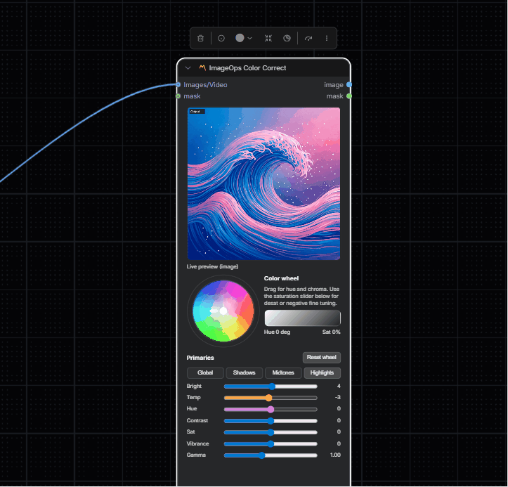

Professional color grading with reference-based correction.

**Inputs:**
- `image` (IMAGE/VIDEO): Source media
- `mask` (MASK, optional): Effect mask

**Parameters:**
- `temperature` (-100 to 100): Color temperature adjustment
- `hue` (-180 to 180): Hue rotation in degrees
- `brightness` (-100 to 100): Brightness adjustment
- `contrast` (-100 to 100): Contrast adjustment
- `saturation` (-100 to 100): Saturation adjustment
- `gamma` (0.2 to 2.2): Gamma correction
- `invert_mask`: Invert mask effect
- `bypass`: Skip processing

**Outputs:** `IMAGE`, `MASK`

---

### 🌫️ ImageOps Blur

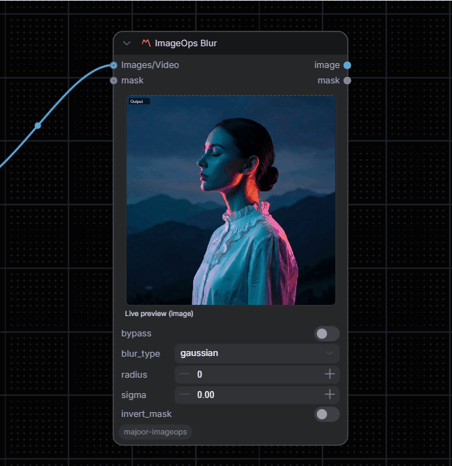

Gaussian blur with optional mask support.

**Inputs:**
- `image` (IMAGE/VIDEO): Source media
- `mask` (MASK, optional): Effect mask

**Parameters:**
- `radius` (0 to 128): Blur support radius in pixels; when set to `0`, support is derived from `sigma`
- `sigma` (0.01 to 64.0): Gaussian sigma value controlling blur spread
- `invert_mask`: Invert mask effect
- `bypass`: Skip processing

**Outputs:** `IMAGE`, `MASK`

---

### 🔴 ImageOps Channels

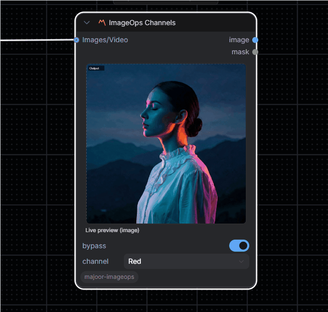

Extract and isolate individual color channels.

**Inputs:**
- `image` (IMAGE/VIDEO): Source media
- `mask` (MASK, optional): Effect mask

**Parameters:**
- `channel`: Red, Green, Blue, or Alpha
- `invert_mask`: Invert mask effect
- `bypass`: Skip processing

**Outputs:** `IMAGE`, `MASK`

---

### 🎚️ ImageOps Mask Convert

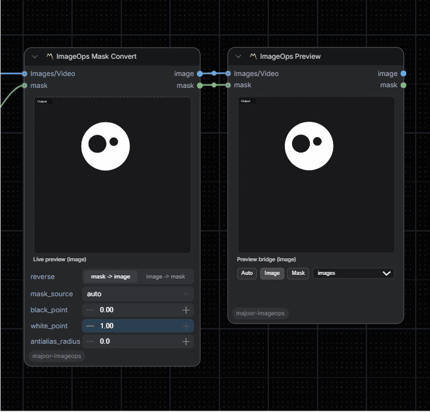

Convert images to masks and masks to previewable images.

**Inputs:**
- `image` (IMAGE/VIDEO, optional): Source media when `reverse` is enabled
- `mask` (MASK, optional): Source mask when `reverse` is disabled

**Parameters:**
- `reverse`: image -> mask when enabled, mask -> image when disabled
- `mask_source`: auto, luma, max_rgb, saturation, red, green, blue, or alpha
- `black_point` / `white_point`: Remap the extracted matte to harden or soften the mask
- `antialias_radius`: Small blur radius before levels to smooth jagged matte edges

**Outputs:** `IMAGE`, `MASK`

---

### ✂️ ImageOps Resize/Crop

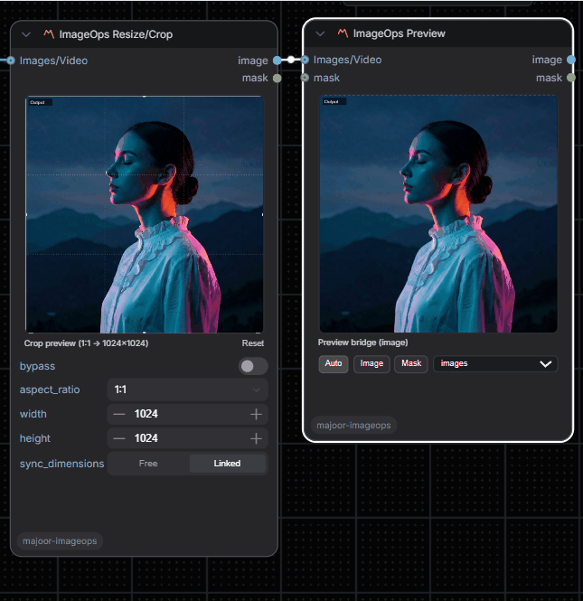

Interactive crop and resize with aspect ratio control.

**Inputs:**
- `image` (IMAGE/VIDEO): Source media
- `mask` (MASK, optional): Effect mask

**Parameters:**
- `aspect_ratio`: Preset ratios (1:1, 3:4, 4:3, 16:9, 9:16, custom)
- `width` (1 to 8192): Output width
- `height` (1 to 8192): Output height
- `sync_dimensions`: Link width/height changes
- `crop_center_x` (0.0 to 1.0): Horizontal crop position
- `crop_center_y` (0.0 to 1.0): Vertical crop position
- `crop_scale` (0.05 to 1.0): Crop zoom level
- Crop outputs include `imageops_crop_bbox` metadata in source-image coordinates for UI overlays/extensions
- `invert_mask`: Invert mask effect
- `bypass`: Skip processing

**Outputs:** `IMAGE`, `MASK`

---

### 🌀 ImageOps Distort

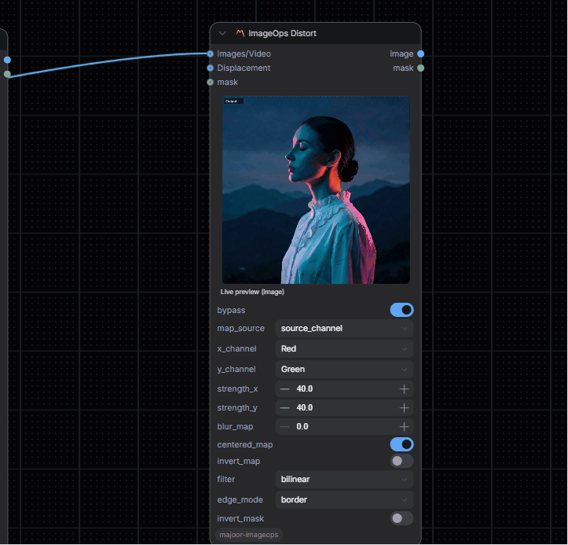

Channel-driven displacement warp inspired by iDistort-style workflows.

**Inputs:**
- `image` (IMAGE/VIDEO): Source media to deform
- `displacement` (IMAGE/VIDEO, optional): External displacement plate when `map_source` is `displacement_channel`
- `mask` (MASK, optional): Used as the distortion map in `mask` mode, otherwise acts as an effect mask

**Parameters:**
- `map_source`: source_channel, displacement_channel, mask, or noise
- `x_channel`, `y_channel`: Choose independent channels for horizontal and vertical deformation
- `strength_x`, `strength_y`: Warp amplitude in pixels
- `centered_map`: Treat mid-gray as neutral displacement
- `invert_map`: Invert the driving map before warping
- `filter`: nearest, bilinear, bicubic
- `edge_mode`: border, reflection, zeros
- Internal noise controls: basis, fractal mode, scale, octaves, lacunarity, gain, seed, and offsets
- `invert_mask`: Invert the effect mask when the mask input is acting as an effect mask

**Outputs:** `IMAGE`, `MASK`

---

### 🔄 ImageOps Transform

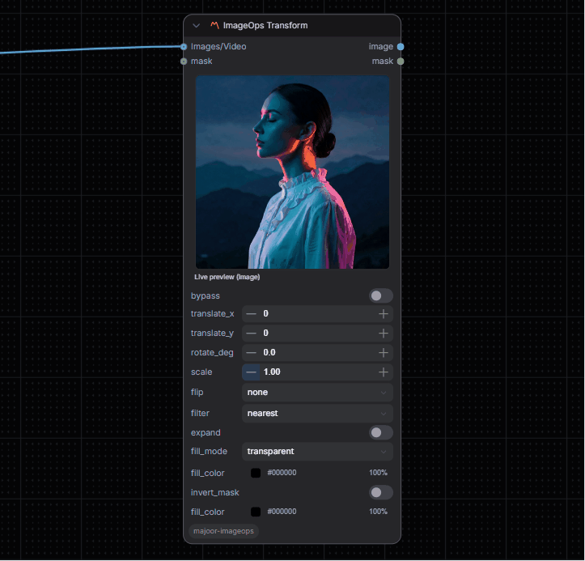

Geometric transformations with quality filters.

**Inputs:**
- `image` (IMAGE/VIDEO): Source media
- `mask` (MASK, optional): Effect mask

**Parameters:**
- `translate_x` (-4096 to 4096): Horizontal offset
- `translate_y` (-4096 to 4096): Vertical offset
- `rotate_deg` (-180 to 180): Rotation angle (clockwise positive)
- `scale` (0.01 to 8.0): Scale factor
- `filter`: Nearest, Bilinear, or Bicubic
- `expand`: Compatibility option; the GPU affine path keeps the output size fixed
- `invert_mask`: Invert mask effect
- `bypass`: Skip processing

**Outputs:** `IMAGE`, `MASK`

---

### 📐 ImageOps Corner Pin

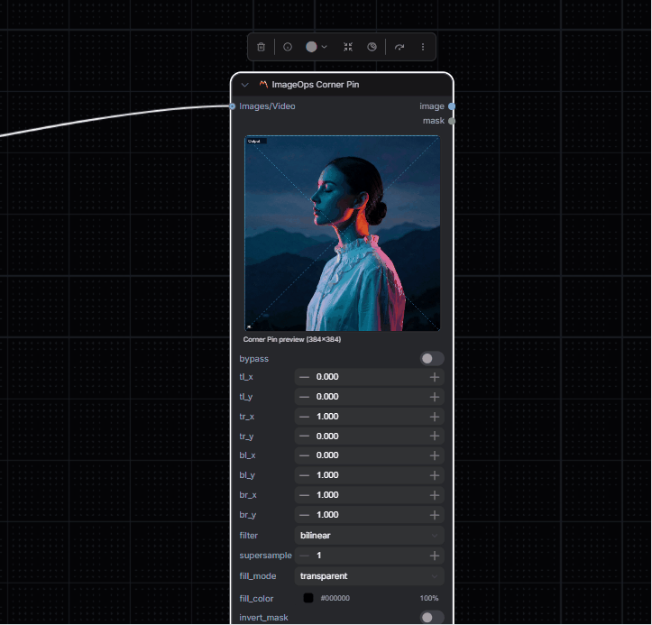

Perspective corner pinning for screen replacement, planar warps, and compositing.

**Inputs:**
- `image` (IMAGE/VIDEO): Source media

**Parameters:**
- `tl_x`, `tl_y`: Top-left destination corner in normalized image coordinates
- `tr_x`, `tr_y`: Top-right destination corner in normalized image coordinates
- `bl_x`, `bl_y`: Bottom-left destination corner in normalized image coordinates
- `br_x`, `br_y`: Bottom-right destination corner in normalized image coordinates
- `filter`: Nearest, Bilinear, or Bicubic
- `supersample`: 1x to 4x multisampling before downsampling
- `edge_mode`: border, reflection, or zeros
- `invert_mask`: Invert the warped transparency mask
- `bypass`: Skip processing

The warp uses batched PyTorch homographies with `grid_sample`; RGBA input is premultiplied before warping so transparent edges stay clean.

**Interactive UI:** Drag any of the four corner handles directly on the preview. Handles snap to the source-frame edges (`0` / `1`) within a small tolerance; hold `Alt` while dragging to disable snapping.

**Outputs:** `IMAGE`, `MASK`

---

### 🧱 ImageOps Pad Out

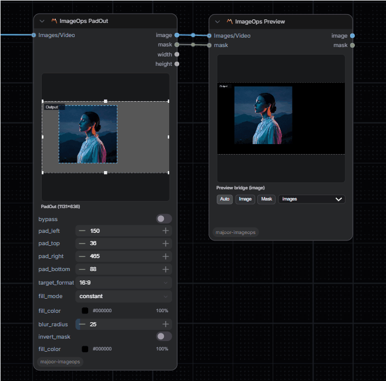

Add borders around an image without scaling the source.

**Inputs:**
- `image` (IMAGE/VIDEO): Source media

**Parameters:**
- `pad_left`, `pad_top`, `pad_right`, `pad_bottom`: Per-side padding in pixels
- `target_format`: Preview ratio preset: custom, 1:1, 16:9, 9:16, 4:3, or 3:4
- `invert_mask`: Invert the padding mask
- `bypass`: Skip processing

PadOut always renders the padded area as solid black; `target_format` is only a UI helper that materializes explicit pad values.

**Outputs:** `IMAGE`, `MASK`, `INT` width, `INT` height

---

### 🎭 ImageOps Invert

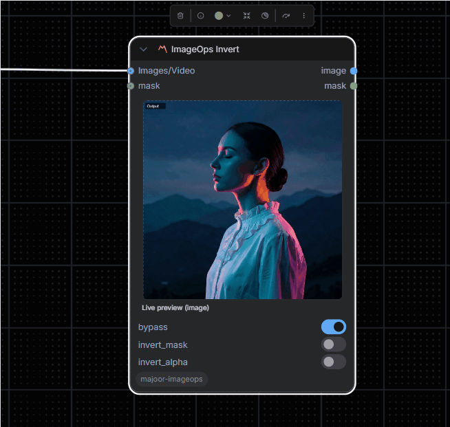

Invert colors and/or the alpha channel independently.

**Inputs:**
- `image` (IMAGE/VIDEO): Source media
- `mask` (MASK, optional): Effect mask

**Parameters:**
- `invert_alpha`: Also invert the alpha channel (only applies to RGBA images with 4 channels)
- `invert_mask`: Invert the output mask
- `bypass`: Skip processing

**Outputs:** `IMAGE`, `MASK`

---

### 🔮 ImageOps Spherize

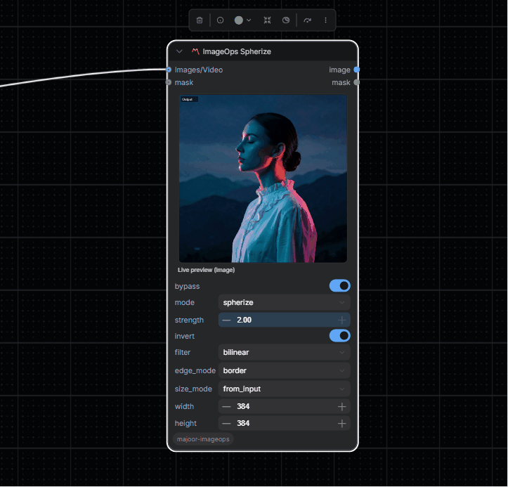

Spherical, fisheye, and equirectangular lens-projection distortions.

**Inputs:**
- `image` (IMAGE/VIDEO): Source media
- `mask` (MASK, optional): Mask to multiply against the circle boundary

**Parameters:**
- `mode`: `spherize` (barrel/pincushion), `fisheye` (equidistant projection), `defisheye` (flatten fisheye), `latlong` (equirectangular → rectilinear), `unlatlong` (rectilinear → equirectangular)
- `strength` (0.0 to 2.0): Effect intensity; 1.0 = full projection, values > 1 push beyond the normal range
- `invert`: Swap the forward and inverse mapping directions (e.g. barrel ↔ pincushion, latlong ↔ unlatlong)
- `filter`: `bilinear`, `bicubic`, or `nearest` — resampling quality
- `edge_mode`: `border`, `reflection`, or `zeros` — behavior at the image boundary
- `size_mode`: `from_input` (use input dimensions) or `custom` (resize to `width` × `height` before applying)
- `width` / `height`: Target dimensions when `size_mode` is `custom`
- `bypass`: Skip processing

The output mask is a unit-circle alpha (1 inside the sphere, 0 outside), multiplied by the optional input mask.

**Outputs:** `IMAGE`, `MASK`

---

### 📏 ImageOps Clamp

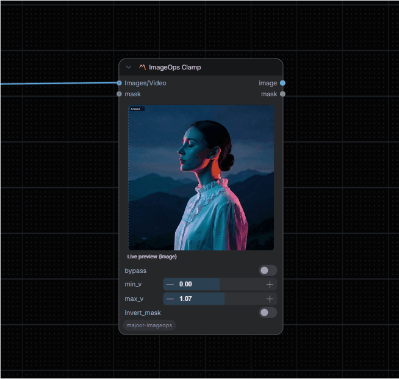

Clamp pixel values to specified range.

**Inputs:**
- `image` (IMAGE/VIDEO): Source media
- `mask` (MASK, optional): Effect mask

**Parameters:**
- `min_v` (-1.0 to 1.0): Minimum value
- `max_v` (0.0 to 2.0): Maximum value
- `invert_mask`: Invert mask effect
- `bypass`: Skip processing

**Outputs:** `IMAGE`, `MASK`

---

### 🔀 ImageOps Merge

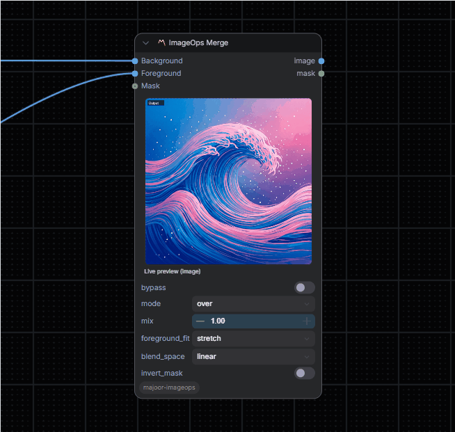

Blend two images with linear-light or sRGB blend modes.

**Inputs:**
- `A` (IMAGE/VIDEO): Background layer
- `B` (IMAGE/VIDEO): Foreground layer
- `mask` (MASK, optional): Effect mask

**Parameters:**
- `mode`: over, add, subtract, multiply, screen, overlay, soft_light, difference, max, min, lighten, darken, color_dodge, color_burn, exclusion, vivid_light, pin_light, hard_mix
- `mix` (0.0 to 1.0): Blend opacity
- `foreground_fit`: stretch, contain, cover, or none for adapting foreground B to background A
- `blend_space`: linear or srgb; linear performs RGB blend math in gamma 1.0 then converts back to sRGB
- `invert_mask`: Invert mask effect
- `bypass`: Skip processing

**Outputs:** `IMAGE`, `MASK`

---

### ImageOps Constant

Generate solid-color or checkerboard RGBA plates.

**Parameters:**
- `mode`: `constant` or `checkerboard`
- `width` / `height`: Output resolution (1 to 8192)
- `batch_size`: Number of frames/images to generate
- `color`: Primary color
- `color_b`: Secondary checkerboard color
- `alpha`: Output opacity, also used as the returned mask
- `tile_size`, `offset_x`, `offset_y`: Checkerboard pattern controls

**Outputs:** `IMAGE`, `MASK`, `INT` width, `INT` height

---

### ImageOps Ramp

Generate linear or radial color ramps.

**Parameters:**
- `width` / `height`: Output resolution (1 to 8192)
- `batch_size`: Number of frames/images to generate
- `color_a`, `color_b`: Start and end colors
- `alpha`: Output opacity, also used as the returned mask
- `start_x`, `start_y`, `end_x`, `end_y`: Normalized ramp control points
- `ramp_shape`: `linear` or `radial`
- `ramp_mode`: `linear`, `ease_in`, `ease_out`, or `smoothstep`
- `invert`: Swap ramp direction

**Outputs:** `IMAGE`, `MASK`, `INT` width, `INT` height

---

### ImageOps Noise

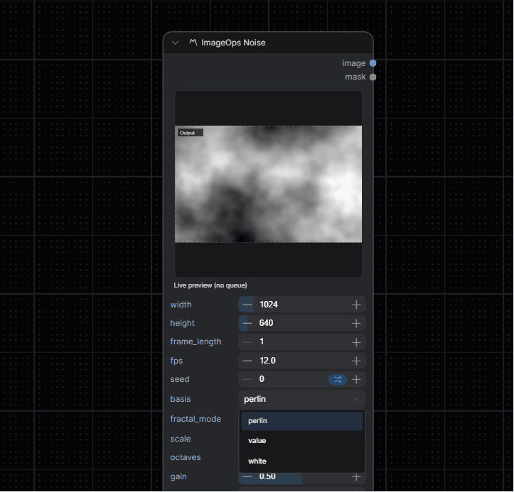

Procedural texture generator for masks and grayscale or color noise plates.

**Parameters:**
- `width` / `height`: Output resolution (64 to 8192)
- `frame_length`: Number of frames to generate (1 to 256)
- `fps`: Preview playback speed
- `seed`: Deterministic noise seed (🎲 button randomizes within widget range)
- `basis`: `perlin`, `value`, or `white`
- `fractal_mode`: `none`, `fbm`, `turbulence`, or `ridged`
- `scale`: Primary feature size
- `octaves` (1 to 12), `gain` (0.0 to 1.0): Fractal shaping controls
- `offset_z`: Static Z offset into the 3D noise field
- `animation_speed`: Z offset added per frame — higher = faster animation, 0 = still image
- `seamless`: Tileable X/Y noise for repeating textures
- `contrast`, `invert`: Output tonal shaping
- `low_color`, `high_color`: Color ramp applied to the grayscale output

**Outputs:** `IMAGE`, `MASK`

---

### ImageOps Grain

Add deterministic synthetic grain to image or video batches.

**Inputs:**
- `image` (IMAGE/VIDEO): Source media
- `mask` (MASK, optional): Effect mask

**Parameters:**
- `amount`: Grain intensity
- `blend_mode`: `add`, `overlay`, or `soft_light`
- `monochrome`: Use shared luma grain instead of independent RGB grain
- `animated`: Change grain per frame when generating longer batches
- `frame_length`: Number of output frames when animating a still image
- `fps`: Preview playback speed
- `seed`: Deterministic grain seed (🎲 button randomizes)
- `invert_mask`: Invert mask effect
- `bypass`: Skip processing

**Film stock presets:** `Clean`, `Subtle`, `Cinema`, `B&W`, `Heavy` — one-click buttons that set amount, blend mode, and monochrome together.

**Outputs:** `IMAGE`, `MASK`

---

### ImageOps CameraShake

Apply deterministic camera shake to images or video batches.

**Inputs:**
- `image` (IMAGE/VIDEO): Source media
- `mask` (MASK, optional): Effect mask

**Parameters:**
- `translate_px`: Maximum translation jitter in pixels
- `rotate_deg`: Maximum rotation jitter in degrees
- `zoom`: Maximum zoom jitter around 1.0
- `smoothing`: Smooth random motion between shake targets
- `shake_frequency`: How quickly shake targets change
- `frame_length`: Number of output frames when shaking a still image
- `fps`: Preview playback speed
- `seed`: Deterministic shake seed
- `filter`: `nearest`, `bilinear`, or `bicubic`
- `fill_mode`: `transparent`, `mirror`, `stretch`, `expand`, or `color`
- `fill_color`: Fill color when `fill_mode` is `color`
- `invert_mask`: Invert mask effect
- `bypass`: Skip processing

**Outputs:** `IMAGE`, `MASK`

---

### ImageOps Keyer

Create an alpha matte from color distance or luma.

**Inputs:**
- `image` (IMAGE/VIDEO): Source media
- `mask` (MASK, optional): Multiplied into the generated matte

**Parameters:**
- `mode`: `color` or `luma`
- `key_color`: Primary key color
- `key_colors`: UI-managed JSON list for multi-color picking
- `tolerance`: Hard key threshold
- `softness`: Soft edge width around the threshold
- `gain`: Matte boost after keying
- `blur`: Gaussian matte blur radius
- `invert`: Invert the generated matte
- `invert_mask`: Invert the optional input mask before multiplying it into the matte
- `bypass`: Skip processing

**Interactive UI:** Click `Pick` to enter eyedropper mode and sample colors from any visible preview canvas — the picker accumulates multiple samples into `key_colors` for tighter mattes.

**Outputs:** `IMAGE`, `MASK`

---

### ImageOps Text

Composite multiline text over image or video batches.

**Inputs:**
- `image` (IMAGE/VIDEO): Source media
- `mask` (MASK, optional): Effect mask
- `font_path` (STRING, optional): Path to a `.ttf` font

**Parameters:**
- `text`: Multiline text content
- `x`, `y`: Normalized text anchor position
- `font_size`: Font size in pixels
- `color`: Text fill color (💧 eyedropper button lets you pick from any visible preview)
- `opacity`: Text opacity
- `align`: `left`, `center`, or `right`
- `line_spacing`: Spacing between text lines
- `stroke_width`, `stroke_color`: Optional text outline (💧 eyedropper available)
- `invert_mask`: Invert mask effect
- `bypass`: Skip processing

**Outputs:** `IMAGE`, `MASK`

---

### 🖌️ ImageOps Paint

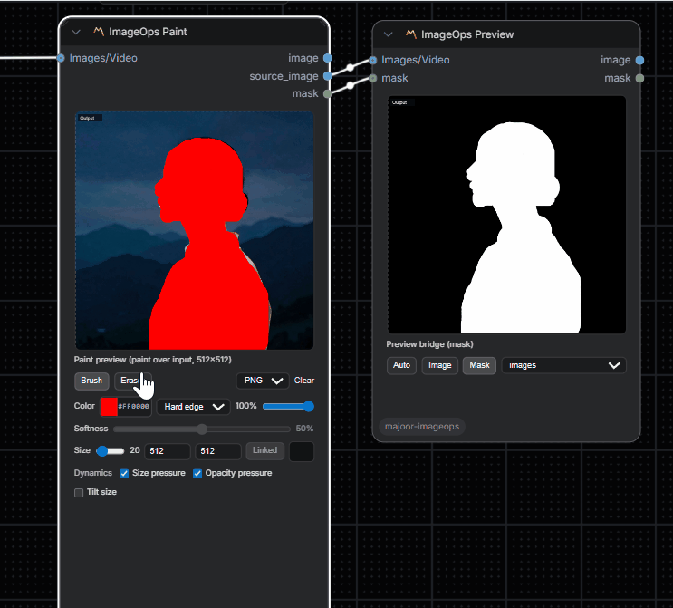

Digital painting and drawing tool.

**Inputs:**
- `image` (IMAGE/VIDEO, optional): Base media (creates blank canvas if not provided)

**Parameters:**
- `width` (64 to 4096): Canvas width
- `height` (64 to 4096): Canvas height
- `sync_dimensions`: Link width/height changes
- `bg_color`: Background color (hex)
- `tool`: Brush or Eraser
- `brush_color`: Brush color (hex)
- `brush_opacity` (0.0 to 1.0): Brush transparency
- `brush_size` (1 to 256): Brush diameter
- `brush_pressure_size`: Pen pressure modulates brush diameter
- `brush_pressure_opacity`: Pen pressure modulates brush opacity
- `brush_tilt_size`: Pen tilt can widen the brush footprint
- `overlay_format`: WebP or PNG payload encoding
- `overlay_data`: Encoded overlay payload; the preview stores cropped visible bounds to reduce transfer size
- `overlay_layers`: Optional JSON layer list for composing multiple overlay payloads
- `invert_mask`: Invert mask effect
- `bypass`: Skip processing

The node still accepts older full-frame Base64 PNG `overlay_data` values. New preview payloads are cropped to the visible painted bounds and can use WebP when the browser supports it; `overlay_layers` accepts `{"layers":[{"data":"...","opacity":1,"enabled":true}]}` for non-destructive multi-layer overlays.

**Outputs:** `IMAGE`, `MASK`

---

### ImageOps FrameRange

Trim, freeze, and repeat image/video frame batches.

**Inputs:**
- `image` (IMAGE/VIDEO): Source batch or video frames

**Parameters:**
- `trim_start`: First frame to keep
- `trim_end`: Last frame to keep; `-1` means the final input frame
- `frame_hold`: Output one held frame instead of the full trimmed range
- `hold_frame`: Frame index to hold, clamped inside the trimmed range
- `repeat`: Repeat the selected range
- `repeat_mode`: `loop`, `bounce`, `reverse`, `input_duration`, `custom_count`, or `freeze`
- `custom_frame_count`: Output length used by repeat modes with an explicit output count
- `bypass`: Skip processing

**Outputs:** `IMAGE`, `INT` frame_count

---

### ImageOps Append

Concatenate multiple image/video batches into one frame sequence.

**Inputs:**
- `image_1`, `image_2`, ... (IMAGE/VIDEO): Clip inputs, with dynamic slots managed by the preview UI

**Parameters:**
- `fit_mode`: `strict`, `resize_to_first`, or `pad_to_max`
- `trims_json`: UI-managed clip trim data
- `bypass`: Return the first trimmed clip only

Strict mode requires matching dimensions. `resize_to_first` resizes later clips to the first clip; `pad_to_max` centers clips on a black canvas sized to the largest connected clip.

**Outputs:** `IMAGE`, `INT` frame_count, `INT` width, `INT` height

---

### 🎬 ImageOps Comp

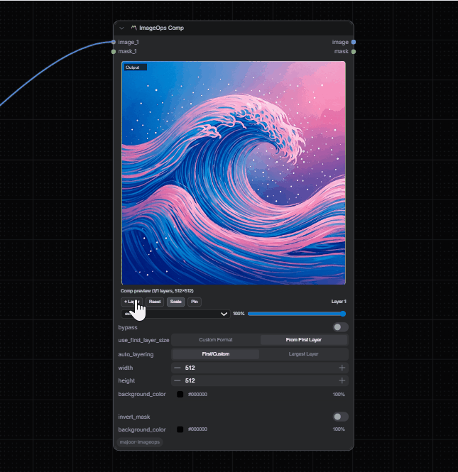

Multi-layer compositor with professional controls.

**Inputs:**
- `image_1`, `image_2`, ... (IMAGE/VIDEO): Layer inputs
- `mask_1`, `mask_2`, ... (MASK): Per-layer masks
- Dynamic slot system with auto-expansion

**Parameters:**
- `bypass`: Skip processing
- `use_first_layer_size`: Use first layer as canvas size
- `auto_layering`: Use the largest connected layer dimensions as canvas size
- `width` (1 to 8192): Custom canvas width
- `height` (1 to 8192): Custom canvas height
- `background_color`: Canvas background (hex)
- `layers_json`: Layer configuration (auto-managed by UI)
- `invert_mask`: Invert output mask

**Interactive UI Features:**
- ➕ Add layer button
- 🔄 Reset layer button
- 🎨 Blend mode selector per layer
- 🎚️ Opacity slider per layer
- 🖱️ Drag-to-position layers on preview

**Keyboard shortcuts** (when the preview canvas has focus / pointer is over it):
- `Delete` / `Backspace` — remove the selected layer
- `1` … `9` — select the layer at that index

**Outputs:** `IMAGE`, `MASK`

---

### 👁️ ImageOps Preview
Preview output node with advanced visualization modes.

**Inputs:**
- `image` (IMAGE/VIDEO): Source media
- `mask` (MASK, optional): Mask to preview

**Parameters:**
- `preview_target`: auto, image, or mask
- `mode`: 
  - `images`: Individual frames
  - `strip`: Horizontal strip for batch inspection
  - `animated_webp`: Animated WebP preview
  - `animated_gif`: Animated GIF preview

> 📌 An optional `reference` (IMAGE) input for split A/B comparison is planned — see `memories/repo/ab-compare-design.md` in the workspace for the design.

**Outputs:** `IMAGE`, `MASK`

---

## 🔧 Bypass Mode

All processing nodes expose a **`bypass`** parameter (boolean). When enabled:
- ✅ Node returns input unchanged
- ✅ Live preview skips applying the operation
- ✅ Useful for A/B comparison and workflow debugging

---

## 🖥️ Live Preview (Frontend)

### Architecture

| File | Purpose |
|------|---------|
| `js/preview/host.js` | Widget injection, video loop, panel orchestration |
| `js/preview/renderer.js` | Recursive render with caching (recursion limit: 64) |
| `js/preview/registry.js` | Adapter selection (core/WAS/VHS/generic/ImageOps) |
| `js/preview/ops.js` | Preview ops implementation (single source for preview behavior) |
| `js/preview/shared/preview-widget.js` | Compact panel builder (collapsible >4 controls, dblclick reset, 🎲 seed randomize) |
| `js/preview/shared/eyedropper.js` | Cross-canvas color picker (used by Text, Keyer) |

### Interop Support

| Source | Adapters |
|--------|----------|
| **Core** | Basic invert/sharpen/blend (best effort) |
| **WAS** | Heuristics for common nodes |
| **VHS** | Video frame sources |
| **Generic** | Fallback adapter |

> ⚠️ **Fail-Soft**: Unsupported nodes don't break the graph - they simply bypass preview processing.

---

## ⚙️ Configuration

### Preview Canvas Size
```javascript
localStorage["imageops.preview.canvasSize"] = 512; // Default: 512px
```

### Large Image Warning Threshold
```bash
# Environment variable (in MB)
IMAGEOPS_LARGE_IMAGE_WARN_MB=2048  # Default: 2048 MB
```

---

## 📝 Notes & Troubleshooting

### ⚠️ Deprecation Warnings
If ComfyUI logs `[DEPRECATION WARNING]`, another extension is using legacy frontend APIs. This doesn't affect ImageOps functionality.

### 🎥 Video/Frame Sources
Some packs expose video via custom types. Best results when upstream provides frames as `IMAGE` batches.

### 🔌 Input Types
- **IMAGE**: Standard ComfyUI image batches `[B, H, W, C]`
- **VIDEO**: Frame sources from video nodes (VHS, etc.)
- **MASK**: Single-channel masks `[B, H, W]`

### 🎨 Blend Modes Reference

| Mode | Description |
|------|-------------|
| `over` | Standard alpha compositing |
| `add` | Additive blending (brightens) |
| `subtract` | Subtractive blending (darkens) |
| `multiply` | Multiply colors (darkens) |
| `screen` | Screen blend (brightens) |
| `difference` | Absolute difference |
| `max` | Maximum of each channel |
| `min` | Minimum of each channel |

### 🎛️ Compositor Blend Modes

| Mode | Canvas Operation |
|------|------------------|
| `over` | source-over |
| `add` | lighter |
| `multiply` | multiply |
| `screen` | screen |
| `overlay` | overlay |
| `soft_light` | soft-light |
| `difference` | difference |
| `lighten` | lighten |
| `darken` | darken |
| `color_dodge` | color-dodge |
| `color_burn` | color-burn |
| `exclusion` | exclusion |

---

## 🏗️ Technical Details

### Batch Processing
All nodes process batches natively:
- Single images: `[1, H, W, C]`
- Image sequences: `[B, H, W, C]`
- Video frames: `[B, H, W, C]`

### Mask Handling
- Masks are automatically prepared and matched to reference dimensions
- `invert_mask` affects both processing and output mask
- Alpha channel extracted as mask when available

### Color Space
- All processing in linear float32 `[0.0, 1.0]`
- Luma weights: `[0.2126, 0.7152, 0.0722]` (Rec. 709)
- Gamma safe range: `0.2` to `5.0`

### Performance
- Live preview uses optimized canvas rendering
- Recursive render cache limit: 64 nodes
- Large image warning threshold: 2048 MB (configurable)

---

## 📄 License

*Check the repository for license information.*

---

## 🙏 Credits

**Author**: Majoor  
**Category**: `image/imageops`  
**Version**: 0.1.4

---

## 📋 Changelog

### Recent changes
- **Compact panel UX** — double-click any control resets it to its default; panels with more than 4 controls collapse into a `<details>` block and remember their open/closed state per node class via `localStorage` (`imageops.ui.<NodeClass>.compactPanelOpen`)
- **Eyedropper buttons** — Text node (Fill / Stroke colors) and Keyer (`Pick`) sample colors from any visible preview canvas via a floating swatch overlay; ESC / right-click / clicking outside a canvas cancels
- **🎲 Seed randomize** — every native panel exposing an INT widget named `seed` (Noise, Grain, CameraShake) gets a one-click randomize button next to the input
- **Grain film presets** — `Clean`, `Subtle`, `Cinema`, `B&W`, `Heavy` one-click buttons configure amount + blend mode + monochrome together
- **Corner Pin snap** — corner handles snap to the source-frame edges (`0` / `1`) within a small tolerance; hold `Alt` to disable
- **Comp keyboard shortcuts** — `Delete` / `Backspace` removes the selected layer, digits `1`–`9` select a layer by index (only active when the preview canvas has focus or the pointer is over it)
- **Removed unimplemented claims** — earlier README entries advertised Histogram / Waveform / Vectorscope / Zebra / A-B Compare on `ImageOpsPreview`; those features were never shipped and have been removed from the docs. A `reference` input for A/B compare is planned (design in `memories/repo/ab-compare-design.md`)
- **New ImageOps nodes** — Append, CameraShake, Constant, FrameRange, Grain, Keyer, Ramp, and Text added to the node list and documented in Node Details
- **ImageOps Spherize** — new node with five projection modes (spherize, fisheye, defisheye, latlong, unlatlong), bicubic/bilinear/nearest filter, edge modes, custom output size, and circle-mask output
- **ImageOps Corner Pin** — bicubic interpolation option added
- **ImageOps Color Correct** — enhanced color correction capabilities
- **ImageOps Preview** — improved noise node performance and zoom/pan interactions
- **ImageOps Invert** — `invert_alpha` is now a proper UI checkbox (previously in the signature but not exposed); RGBA images can invert color and alpha independently
- **ImageOps Noise** — incremental CPU transfer during frame generation reduces peak VRAM usage on large batches; deprecated legacy parameters (`seed_step`, `compute_device`, `offset_x/y`, `frame_offset_x/y/z`, `lacunarity`) removed from UI (still accepted in saved workflows for backwards compatibility)

---

<div align="center">

**Made with ❤️ for the ComfyUI community**

[Report Issues](https://github.com/yourusername/ComfyUI-Majoor-ImageOps/issues) • [Request Features](https://github.com/yourusername/ComfyUI-Majoor-ImageOps/issues)

</div>
